# Procedure to Create Zoom Account
## Desktop/Laptop

1. Click on [Zoom Sign up](https://zoom.us/signup){:target="_blank" rel="noopener"} and select your birth month, day and  year
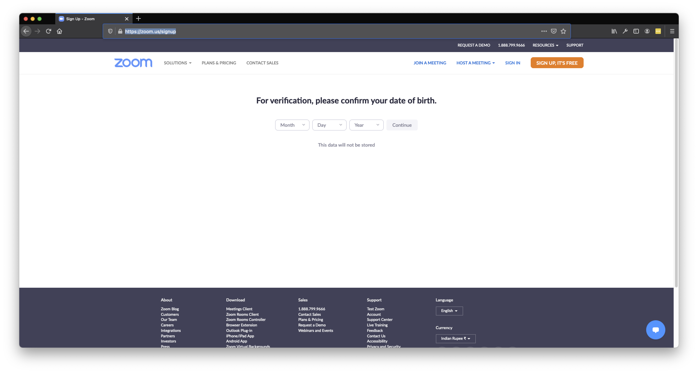

2. Enter your email or signup with social logins using the links at the bottom. Please use the same email that you used to register for the course. You can either enter your email address or use your apple, facebook or google account to create your account. In case you use your apple account, please make sure you do not use a dummy email, but your actual email to create the account. 
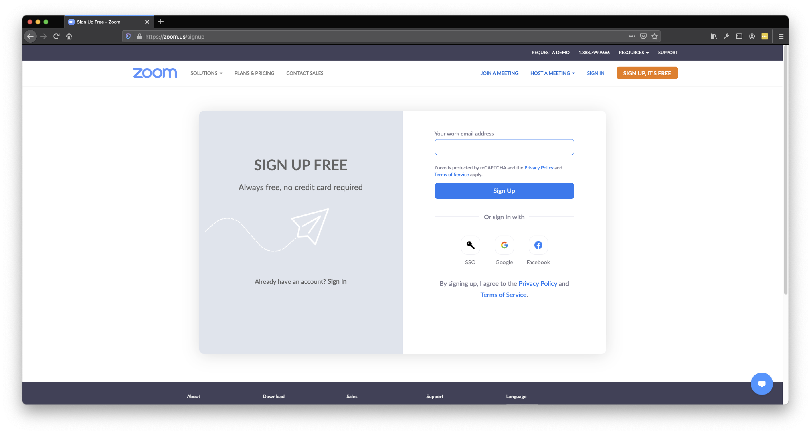

3. Zoom will send you an email to verify. 
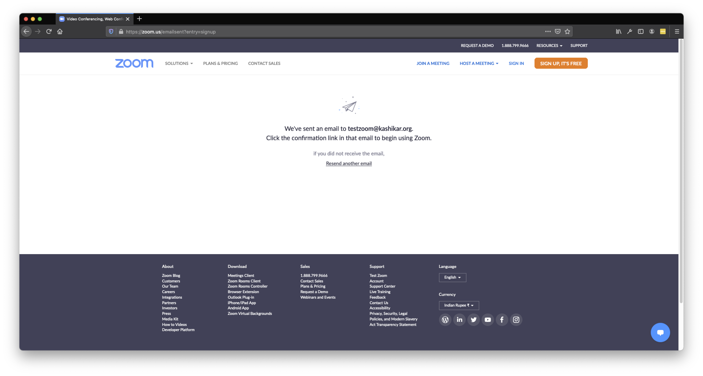

4. Please open your email app and check your inbox. In case, there is no email from Zoom, please check your spam folder. Click on activate account
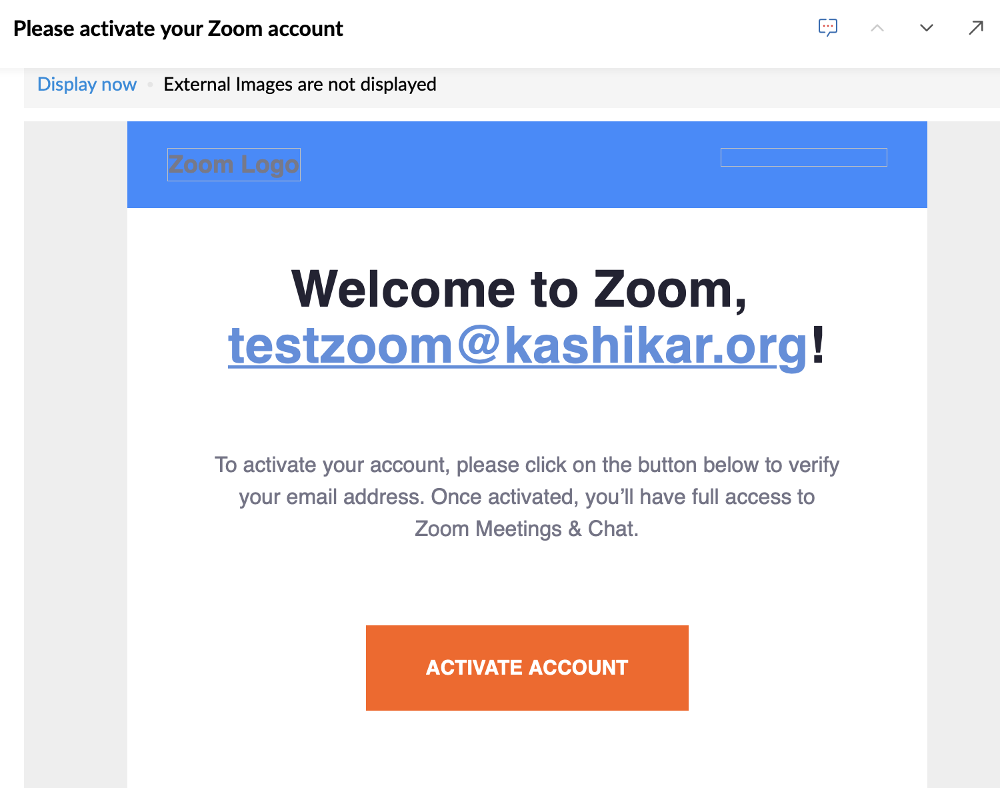

5. Set your first name and last name to what you have used while registering for the course. Choose a password and enter it in the password and confirm password fields. Click on Continue
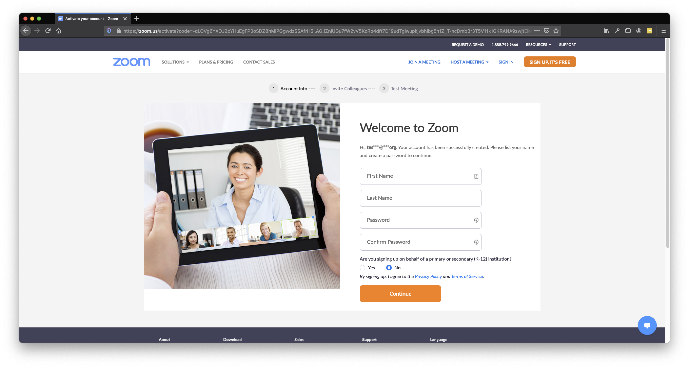

6. Thats it. If you have made it till here, you are set to join the Zoom meeting for the course. You can close the window.
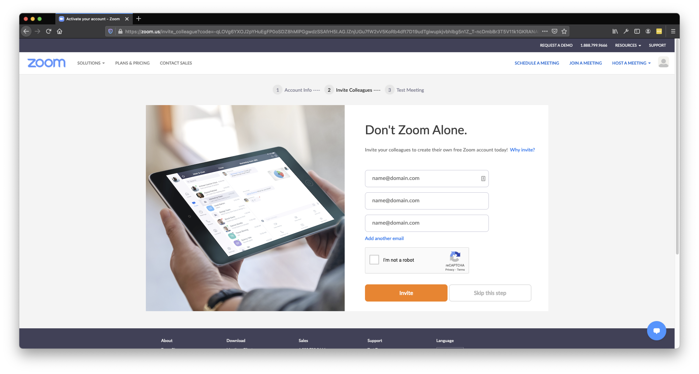

## Mobile
1. Click on [Zoom Sign up](https://zoom.us/signup) and select your birth month, day and  year
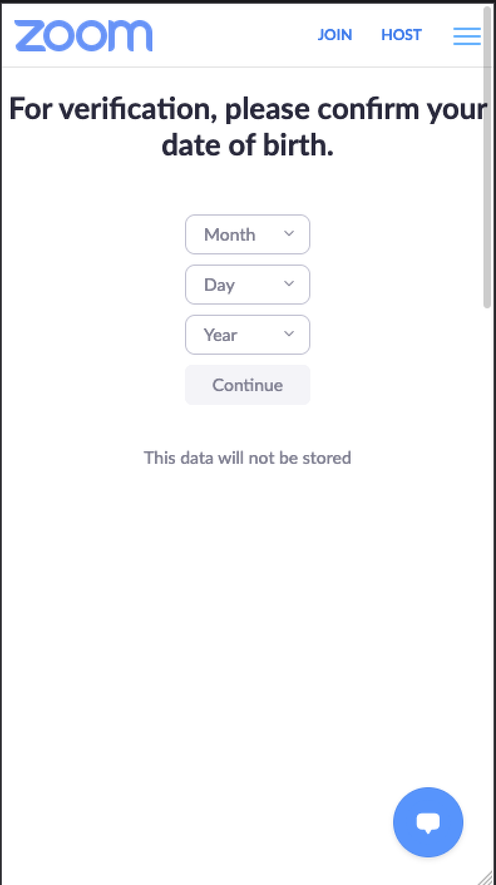

2. Enter your email or signup with social logins using the links at the bottom. Please use the same email that you used to register for the course. You can either enter your email address or use your apple, facebook or google account to create your account. In case you use your apple account, please make sure you do not use a dummy email, but your actual email to create the account. 
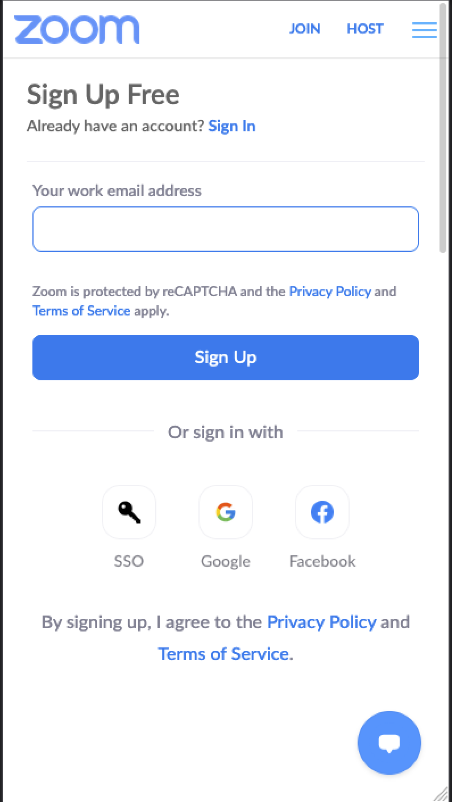

3. Zoom will send you an email to verify. 
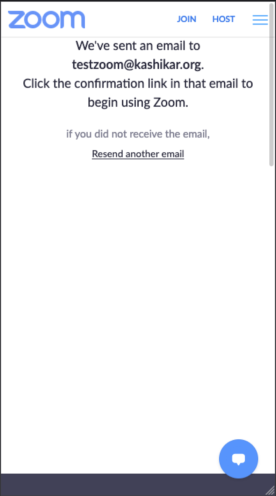

4. Please open your email app and check your inbox. In case, there is no email from Zoom, please check your spam folder. Click on activate account

5. Set your first name and last name to what you have used while registering for the course. Choose a password and enter it in the password and confirm password fields. Click on Continue
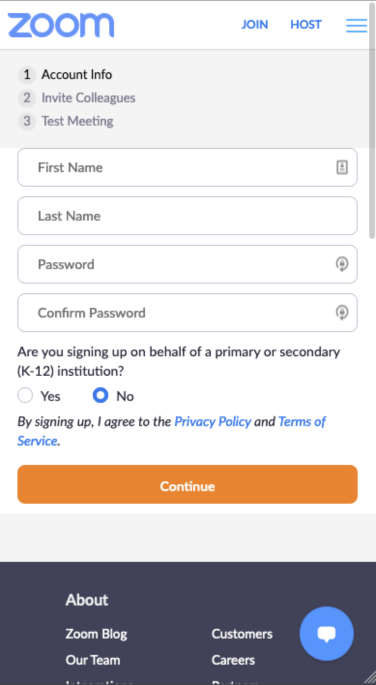

6. Thats it. If you have made it till here, you are set to join the Zoom meeting for the course. You can close the window.
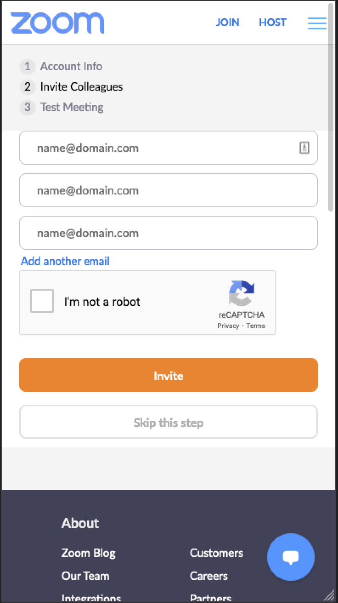
