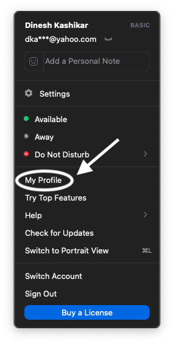

# Procedure to Set Zoom Name before logging in

  - [Desktop/Laptop](#desktoplaptop)
  - [Mobile](#mobile)

## Desktop/Laptop

1. Open your Zoom app. Click on your user icon at the top right, if you are on your desktop/laptop

2. From the dropdown menu, click My Profile
   

3. You can also come here by clicking on preferences and then My Profile in Settings

4. You will be taken to your zoom settings page on the browser. Please click on Edit button as shown

5. Set your first name and last name to what you have used while registering for the course

## Mobile
1. Open your zoom app

2. Click on Settings at the bottom right

3. Click on your name at the top

4. Enter your first name and last name in the space provided
